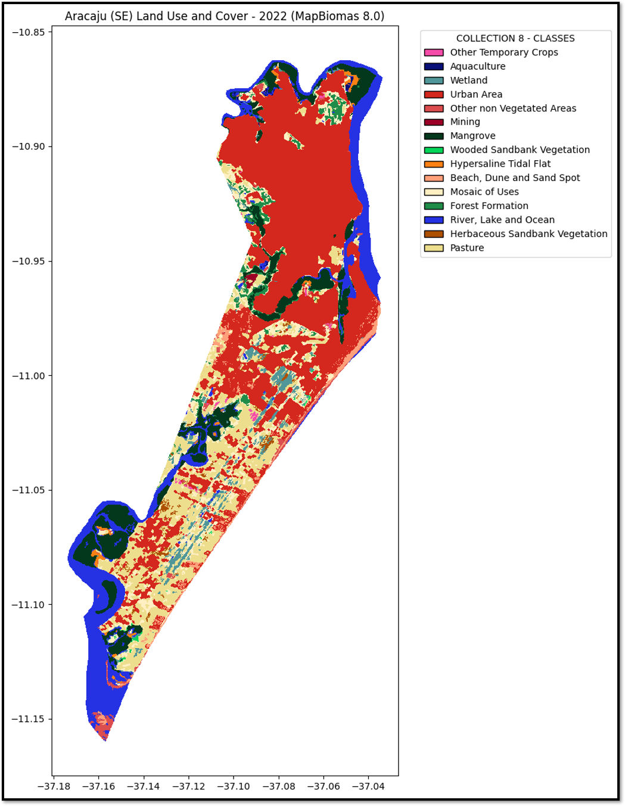
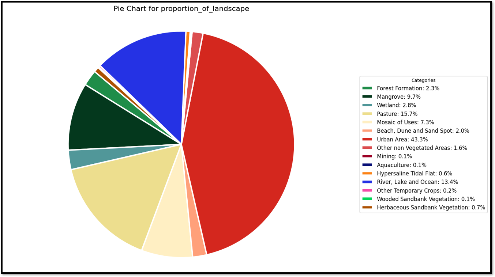

<a href="https://luctinoco.github.io/Caipora/" target="_blank"></a>
# Caipora - Metrics 

## Who is Caipora?
Caipora is a legendary figure from Brazilian folklore, originating from the Tupi-Guarani indigenous culture. The name "Caipora" comes from the Tupi words "caa" (forest) and "pora" (inhabitant), which together mean "inhabitant of the forest."

Caipora is depicted as a small, dark-skinned indigenous figure, sometimes with red hair. She fiercely protects the forest and its animals against human threats. Known for playing tricks on hunters and woodcutters, she disorients them and creates illusions to protect the forest's flora and fauna. Often seen riding a peccary (a type of wild pig), she is most active at night.

To appease Caipora, hunters often leave offerings of tobacco or cachaça (a Brazilian alcoholic beverage) in the forest. Respecting her can bring good luck in hunting. Some stories suggest that Caipora can control forest animals, making them invisible or alerting them to the presence of hunters. While sometimes seen as a solitary entity, other stories describe her as part of a community of similar spirits.

## Caipora - Metrics: A Teaching Tool for Public Health Students

Caipora is a Python script specifically designed as a teaching tool for undergraduate and postgraduate students in public health. It simplifies the analysis of landscape metrics from raster data, offering interactive visualizations and saving outputs for further analysis. This tool is particularly focused on educating new students and professionals interested in geoprocessing, epidemiology, and public health.

### The primary educational benefits of Caipora include:

- **Raster File Manipulation:** Learn to import, manage, transform, and operate on raster data, understanding spatial projections and resolutions.
- **Pixel Value Extraction**: Extract and manipulate pixel-stored values, calculate landscape metrics, and create thematic maps.
- **Landscape Metrics Interpretation:** Understand and analyze metrics like diversity, connectivity, and fragmentation, and assess their environmental and epidemiological impacts.

As a teaching tool, Caipora enables users to turn complex geospatial data into meaningful insights, advancing both their education and practical applications in public health.

## Overview

This script leverages various Python libraries to manage raster data, compute landscape metrics, create interactive maps, and handle data formats:

### Libraries Used:

1. **[os](https://docs.python.org/3/library/os.html)**
   - **Description**: This is a standard Python library for interacting with the operating system. It allows you to handle file and directory operations.
2. **[pandas](https://pandas.pydata.org/)**
   - **Description**: A powerful data manipulation and analysis library that provides data structures like DataFrames to handle structured data efficiently.
3. **[rasterio](https://rasterio.readthedocs.io/en/latest/)**
   - **Description**: A library for reading and writing geospatial raster data. It allows easy manipulation and analysis of raster data.
4. **[folium](https://python-visualization.github.io/folium/)**
   - **Description**: A library for creating interactive maps using Leaflet.js. It is useful for visualizing geospatial data.
5. **[numpy](https://numpy.org/)**
   - **Description**: A fundamental package for scientific computing in Python. It provides support for arrays, matrices, and many mathematical functions.
6. **[matplotlib](https://matplotlib.org/).pyplot**
   - **Description**: A plotting library used for creating static, interactive, and animated visualizations in Python.
7. **[geopandas](https://geopandas.org/)**
   - **Description**: An extension of pandas that allows for easy manipulation and analysis of geospatial data. It supports operations on geometric types.
8. **[shapely](https://shapely.readthedocs.io/en/stable/).geometry**
   - **Description**: A library for the manipulation and analysis of planar geometric objects. The `box` function is used to create rectangular geometries.
9. **[matplotlib](https://matplotlib.org/).patches**
   - **Description**: This submodule contains a collection of patch objects, including `Patch`, which is used to create various geometric shapes in a plot.
10. **[matplotlib](https://matplotlib.org/).colors**
    - **Description**: This submodule includes functions and classes for handling colors, including `ListedColormap`, which is used to create custom colormaps.
11. **[IPython](https://ipython.org/).display**
    - **Description**: Contains functions to display rich media in notebooks, such as images, HTML, and widgets.
12. **[ipywidgets](https://ipywidgets.readthedocs.io/en/stable/)**
    - **Description**: A library for creating interactive HTML widgets for notebooks, enabling the creation of interactive GUIs.
13. **[pylandstats](https://pylandstats.readthedocs.io/en/latest/landscape.html):**
    - **Description**: A library for landscape metrics computation and spatial pattern analysis, useful in landscape ecology and spatial analysis studies.
14. **google.colab.drive**
    - **Description**: Provides tools to mount and interact with Google Drive from Google Colab notebooks, enabling access to files stored in Google Drive.

## Functions Implemented:

### `setup_environment()`
- Ensures all required Python packages are installed, simplifying setup for new users.

### `check_drive_mount()`
- Checks if Google Drive is mounted and mounts it if not, ensuring access to files stored in Google Drive.

### `hex_to_rgb(hex_color)`
- Converts a hexadecimal color code to an RGB tuple.

### `read_color_legend(color_file)`
- Reads color legend data from either an Excel (.xlsx) or CSV (.csv) file.

### `plot_pie_chart_by_metric(metric)`
- Plots a pie chart for the given metric, using the color legend and metric data.

### `save_current_figure(b)`
- Saves the currently displayed figure as a PNG file.

### `calculate_save_metrics_and_plot(input_raster, output_folder, output_base_name, color_data, nodata_value=0)`
- Loads raster data using rasterio and computes landscape metrics via pylandstats.
- Saves metrics to a CSV file (`{output_base_name}_metrics_output.csv`).
- Reads a color legend from a data file (`color_data.xlsx` or `color_data.csv`) to assign colors to raster classes.
- Generates a raster plot using matplotlib and GeoPandas, allowing interactive legend customization.
- Creates an interactive pie chart based on selected metrics using ipywidgets.
- Generates an interactive map using folium, saved as an HTML file (`{output_base_name}_map_output.html`).

## Compatibility and Adaptation

While originally designed for land use and land cover rasters from platforms like MapBiomas, this script is modular and adaptable. It can process other raster types with appropriate adjustments to input parameters and data handling.

## Color Data File Requirements

To properly assign colors to raster classes, ensure your color data file (`color_data.xlsx` or `color_data.csv`) meets these requirements:

1. **File Format**: Provide color data in an Excel (`.xlsx`) or CSV (`.csv`) format.
2. **Sheet Structure**: The data file should have:
   - Columns with headers.
   - A `Class_ID` column specifying unique identifiers for raster classes.
   - A `Color` column with hexadecimal color codes (e.g., `#RRGGBB`).
   - If the data file is a `.csv`, the separator must be `;`.

### Example of Color Data Sheet Structure:

| Class_ID | Color     |
|----------|-----------|
| 1        | #FF0000   |
| 2        | #00FF00   |
| 3        | #0000FF   |
| ...      | ...       |

For detailed legend codes from MapBiomas, you can visit their [legend code page](https://brasil.mapbiomas.org/codigos-de-legenda/).

## Running the Script

### Setup Instructions

1. **Clone Repository**: Clone the Caipora repository to your local machine or Google Colab.
   
2. **Run the Script**: Execute the script and follow prompts to input necessary file paths and parameters.

### Example Usage in Google Colab

To use this script in Google Colab, run this command in your Colab environment:

```bash
import os

# Check if the directory exists
if not os.path.exists("Caipora"):
    # Clone the repository if it doesn't exist
    !git clone https://github.com/luctinoco/Caipora.git

# Change into the directory
%cd Caipora

# Run the notebook
%run Caipora.ipynb
```
## This command does the following steps:

The command `git clone https://github.com/luctinoco/Caipora.git` downloads a repository from GitHub with the URL provided. Here's what each part does:

- `git clone`: This Git command is used to make a copy of a repository from a remote source (in this case, GitHub).
- `https://github.com/luctinoco/Caipora.git`: This is the URL of the repository you want to clone.

After cloning the repository, `%cd Caipora` changes the current directory to `Caipora`, assuming it exists in your current working directory.

Finally, `%run Caipora.ipynb` executes the Google Colab file `Caipora.ipynb`.

### Or click in this banner:

[](https://colab.research.google.com/github/luctinoco/Caipora/blob/main/Caipora.ipynb)

### Follow these examples steps to execute the Caipora script:

1. **Path to Output Folder:**
   - Enter the path to the output folder where results will be saved: `/content/drive/My Drive/Output`
   - Provide the path to the folder where you want the results to be saved. If the folder does not exist, the script will create it automatically.

2. **Path to Raster File (`*.tif`):**
   - Enter the path to the input raster (.tif) file: `/content/drive/My Drive/raster_data.tif`
   - Provide the path to the raster file in `*.tif` format. The script will check if the file exists and has the correct extension.

3. **Path to Color Legend Data color File (`color_data.xlsx`):**
   - Input the path to the color legend Data color file in `*.xlsx` or `*.csv`format.
   - The script will verify if the file exists and has the correct extension.

4. **Base Name for Output Files (without extension):**
   - Enter the base name for output files (without extension): `output_results`
   - Type a base name for the output files that will be generated by the script. This name will be used for the CSV metrics files and the HTML interactive map file.
  
## Example Usage:

If you specify `output_results` as your base name, your script might produce files like:
- `output_results_plot.png` (for the raster plot)
- `output_results_metrics.csv` (for metrics data)
- `output_results_map.html` (for an interactive map)

This naming convention makes it clear which files belong together and simplifies management and interpretation of your script’s outputs.

## Here is an example of a folder structure on Google Drive for use in Google Colab:

### Without outputs
```bash
/MyDrive/
    ├── MAPBIOMAS-EXPORT/ '/content/drive/MyDrive/MAPBIOMAS-EXPORT'
    │   ├── Legend-collection-8.xlsx '/content/drive/MyDrive/MAPBIOMAS-EXPORT/Legend-collection-8.xlsx'
    │   ├── mapbiomas-brazil-collection-80-2022.tif '/content/drive/MyDrive/MAPBIOMAS-EXPORT/mapbiomas-brazil-collection-80-2022.tif'
```


### With outputs
```bash
/MyDrive/
    ├── MAPBIOMAS-EXPORT/ '/content/drive/MyDrive/MAPBIOMAS-EXPORT'
    │   ├── Legend-collection-8.xlsx '/content/drive/MyDrive/MAPBIOMAS-EXPORT/Legend-collection-8.xlsx'
    │   ├── base_name_map_output.html '/content/drive/MyDrive/MAPBIOMAS-EXPORT/base_name_map_output.html'
    │   ├── base_name_metrics_output.csv '/content/drive/MyDrive/MAPBIOMAS-EXPORT/base_name_metrics_output.csv'
    │   ├── base_name_raster_plot.png '/content/drive/MyDrive/MAPBIOMAS-EXPORT/base_name_raster_plot.png'
    │   ├── mapbiomas-brazil-collection-80-2022.tif '/content/drive/MyDrive/MAPBIOMAS-EXPORT/mapbiomas-brazil-collection-80-2022.tif'
```

    
## Base Name for Output Files (without extension):

When you provide a base name, such as `output_results`, it serves as a prefix for naming various output files generated by your script. Here’s how it applies:

1. **Raster Plot Title:**
   - The raster plot or map generated from your script might include a title or caption. This title could be automatically generated using the base name you provide. For example, if your base name is `output_results`, the title of the raster plot might be something like "Output Results".

2. **Other Output Files:**
   - Besides the raster plot, your script might generate other output files such as CSV files containing metrics or an HTML interactive map. These files could also use the base name to distinguish them. For instance, `output_results_metrics.csv` or `output_results_map.html`.

### Why Use a Base Name?

- **Consistency:** Using a base name ensures that all related output files are easily identifiable as belonging to the same run or batch of your script.
  
- **Automation:** It allows your script to generate output files without requiring manual naming each time, which can be error-prone and time-consuming.

- **Organizational:** Helps in organizing multiple runs or versions of your script, especially if you're running it multiple times with different inputs or parameters.

## Explain the Plots

The Caipora script generates several plots and visualizations based on the input raster data and color legend. Here’s an explanation of each plot:

### 1. Raster Plot

The raster plot visualizes the input raster data, where each pixel represents a different land cover or land use class. The plot uses colors specified in the color legend to differentiate between classes. Here’s what you can observe from the raster plot:

- **Color Representation:** Each class from the raster data is represented by a specific color, as defined in the `color_data.xlsx` file.
  
- **Spatial Distribution:** You can visually interpret the spatial distribution of different land cover types across the study area.
  
- **Legend:** The legend accompanying the plot explains the correspondence between colors and land cover classes, aiding in interpretation.



### 2. Metrics Output (CSV)

The metrics computed from the raster data, based on the [pylandstats](https://pylandstats.readthedocs.io/en/latest/landscape.html) library, are saved into a CSV file (`{output_base_name}_metrics_output.csv`).

### 3. Pie Chart (Interactive)

An interactive pie chart generated using ipywidgets complements the raster plot by illustrating the distribution of selected landscape metrics across different land cover classes. Features of the pie chart include:

- **Metric Selection:** Users can select different metrics (e.g., class area, edge density) from a dropdown menu to visualize.
  
- **Dynamic Updates:** As metrics are selected or changed, the pie chart dynamically updates to reflect the proportion of each class contributing to the selected metric.

- **Save Button:** A "Save" button is provided to save the currently displayed pie chart as a PNG file. When clicked, the save button triggers a function that saves the chart with a filename based on the selected metric. This allows users to easily save and reference their visualizations for reports or further analysis.



#### Here's a detailed explanation of how the save button works:

- **Button Creation:** The save button is created using ipywidgets.Button and is styled to be visually distinct with a description of "Save" and a green color indicating a positive action.

- **Button Functionality:** The save button is linked to the `save_current_figure` function, which is executed when the button is clicked. This function checks if a metric has been selected and a pie chart is currently displayed.

- **File Naming and Saving:** The `save_current_figure` function constructs a filename based on the selected metric, ensuring that the saved file is appropriately named for easy identification. The pie chart is then saved in the specified output folder.

This combination of interactive selection and saving capabilities enhances the utility of the pie chart, making it a valuable tool for both visualization and documentation of landscape metrics.

### 4. Interactive Map

The interactive map generated using folium provides an interactive visualization of landscape metrics computed from the raster data. Key features of the interactive map include:

- **Layer Control:** Users can toggle different layers to visualize specific metrics such as class area, edge density, or shape index.
  
- **Tooltip Information:** Hovering over map elements provides additional information such as metric values or class identifiers.
  
- **Export Functionality:** The map can be exported as an HTML file (`{output_base_name}_map_output.html`), allowing for easy sharing and integration into reports or presentations.

<a href="https://luctinoco.github.io/Caipora/images/Aracaju%20(SE)%20Land%20Use%20and%20Cover%20-%202022%20(MapBiomas%208.0)_map_output.html" target="_blank">
    </a>

### 5. Additional Plots (if applicable)

Depending on the metrics computed and the specific configuration of the script, additional plots such as histograms or scatter plots may be generated. These plots can provide further insights into the spatial patterns and characteristics of the landscape metrics.

### Interpretation and Application

- **Public Health Applications:** Understanding landscape metrics is crucial for assessing environmental factors that impact public health, such as urban heat islands or biodiversity conservation.
  
- **Policy and Planning:** Plots generated by Caipora aid policymakers and planners in making informed decisions regarding land use management and conservation strategies.
  
- **Research and Education:** These visualizations support research endeavors and educational purposes by providing clear, interpretable data representations.

By leveraging these plots and visualizations, users can gain valuable insights into landscape metrics derived from raster data, enhancing their understanding and decision-making processes in public health and environmental research.

### Handling Errors

### Error Messages for Incorrect Files

When running the script, you may encounter specific error messages if the files provided are incorrect or cannot be found:

1. **File Not Found Error:**
   - If the script cannot find the specified raster file (*.tif) or color data file (color_data.xlsx) in your Google Drive, it will raise a FileNotFoundError.
   - Example: 
     
FileNotFoundError: No .tif file found at the specified path: /content/drive/My Drive/incorrect_raster.tif


2. **Incorrect File Type Error:**
   - If the provided files do not match the expected file types (*.tif for raster and color_data.xlsx for color data), the script will raise an appropriate error.
   - Example:
     
ValueError: Incorrect file type provided. Expected *.tif raster file or color_data.xlsx or color_data.csv file.


3. **Other Errors:**
   - For any other unforeseen errors related to file reading, parsing, or processing, the script will raise informative error messages to guide troubleshooting.
   - Example:
     
IOError: Unable to read color data from color_data.xlsx. Please check the file format and contents.

### Troubleshooting Tips

- **Double-check File Paths:** Ensure that the paths provided to the raster file and color data file are correct and accessible in your Google Drive.
  
- **Verify File Formats:** Confirm that the raster file is in *.tif format and the color data file is in *.xlsx format with the required structure (Class_ID and Color columns).

- **Check File Permissions:** Make sure you have the necessary permissions to access and read the files from your Google Drive.

By following these guidelines and paying attention to error messages, you can effectively troubleshoot and resolve issues when using the Caipora script.

## Acknowledgments

We extend our gratitude to all contributors, past, present, and future, who help make this project a valuable resource for learners around the world. Together, we can empower the next generation of programmers and creators.

Don't forget to cite this repository if you use its code in your project.

Happy analyzing!

Lucas F. T. Leonardo
